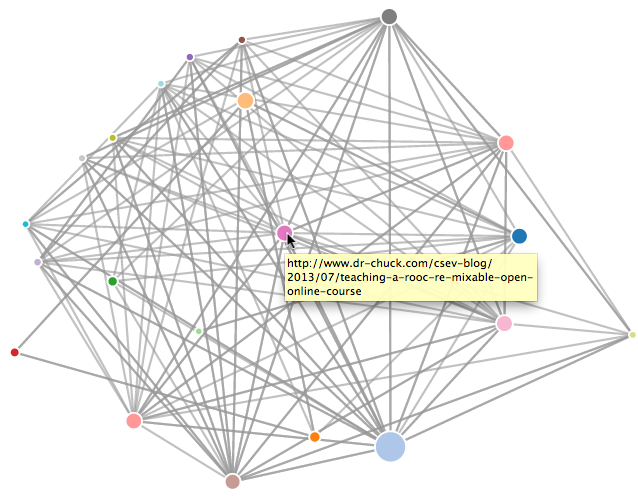

<h2 align="center">My-README.md-Template✅</h2>

   

 
   
    
   
   
   
   
    
   
   </a> 

  <a href="https://github.com/sandip2224/Data_Visualizer-using-D3js"><strong>Explore the docs »</strong></a>

<!-- PROJECT LOGO -->
  

     
    <a href="https://github.com/sandipan_2224/Data_Visualizer-using-D3js">View Demo</a>
    ·
    <a href="https://github.com/sandipan_2224/Data_Visualizer-using-D3js/issues">Report Bug</a>
    ·
    <a href="https://github.com/sandipan_2224/Data_Visualizer-using-D3js/issues">Request Feature</a>
  

<!-- TABLE OF CONTENTS -->
<h2 align="center">Table of Contents</h2>

<!-- 

 -->

- [Preview](#preview)
- [About the Project](#about-the-project)
  - [Built With](#built-with)
- [Prerequisites](#prerequisites)
- [Usage](#usage)
- [License](#license)
- [Contributing](#contributing)
- [Contact](#contact)
- [Acknowledgements](#acknowledgements)

<h2 align="center">Preview</h2>

<!-- ABOUT THE PROJECT -->

<h2 align="center">About the Project</h2>

This project corresponds to the final capstone project of `Python for Everybody` Specialization on Coursera. The project uses Python and D3js to render page rank algorithm deployed on any website and vizualizes it using HTML / CSS / JavaScript as a seperate webpage whose screenshot preview is visible above.  

Here's why it's so awesome:  

* It heps vizualize the number of sub-connected websites from a given URL as a mesh of interconnected paths.😁  
* The vizualization is highly interactive and responds to mouseclick as well.✅  

**Of course you may also suggest changes by forking this repository and creating a pull request or opening an issue.**  

A list of commonly used resources that I find helpful are listed in the acknowledgements.  

<!-- BUILT WITH -->  

<h2 align="center">Built With</h2>

  
  
  
  

  

<!-- PREREQUISITES -->

<h2 align="center">Prerequisites</h2>

This is an example of how to list things you need to set up the project and get it running:  

- [x] HTML 5  
- [x] CSS 3
- [x] Python3
- [x] D3.js

<!-- USAGE -->

<h2 align="center">Usage</h2>

- PageRank (PR) is an algorithm used by google search to rank web pages in their search engine results.  
- It outputs a probability distribution used to represent the likelihood that a person randomly clicking on links will arrive at any particular page.  
- It outputs a vizualization of interconnected pages as a multi-connected mesh of graphs.

_For more examples, please refer to the [Documentation](https://www.geeksforgeeks.org/page-rank-algorithm-implementation/)_  

<!-- LICENSE -->  

<h2 align="center">License</h2>

Distributed under the MIT License. See `LICENSE` for more information.  

<!-- CONTRIBUTING -->
<h2 align="center">Contributing</h2>

Contributions are what make the open source community such an amazing place to be learn, inspire, and create. Any contributions you make are **greatly appreciated**.

1. Fork the Project
2. Create your Feature Branch (`git checkout -b feature/AmazingFeature`)
3. Commit your Changes (`git commit -m 'Add some AmazingFeature'`)
4. Push to the Branch (`git push origin feature/AmazingFeature`)
5. Open a Pull Request  

<!-- CONTACT --> 

<h2 align="center">Contact</h2>

- **Hey guys, I'm Sandipan. Find me** [ here](https://linkeidn.com/in/sandipan0164)  
- **Reach out to me at:** [ sandipan2224@gmail.com](sandipan2224@gmail.com)  

<!-- ACKNOWLEDGEMENTS -->

<h2 align="center">Acknowledgements</h2>

* [Python for Everybody Capstone](https://www.coursera.org/learn/python-data-visualization)
* [GitHub Markdown docs](https://guides.github.com/features/mastering-markdown/)
* [D3.js docs](https://d3js.org/)

<h3 align="right">Built and designed by <em>Sandipan Das</em></h3>
